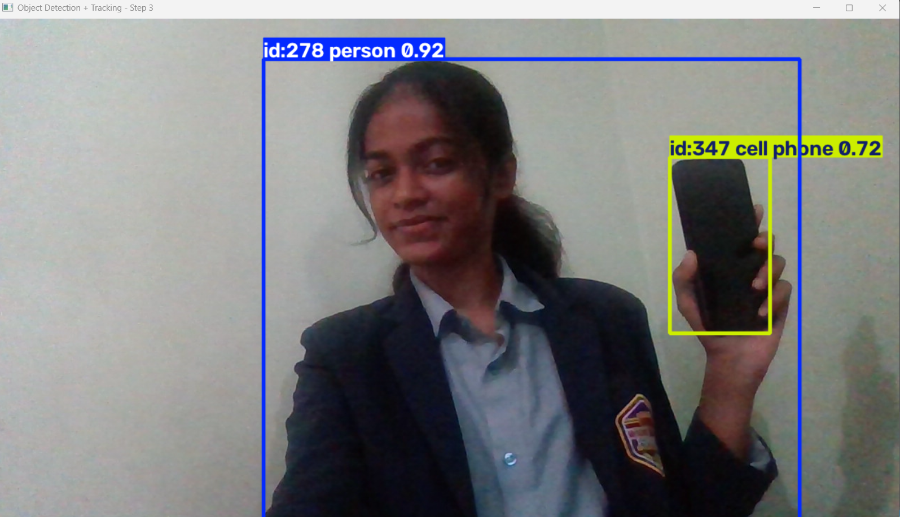

# 🎯 Object Detection and Tracking

A real-time object detection and tracking system built with a pretrained YOLOv8 model and OpenCV, developed as part of the CodeAlpha AI & ML Internship.

## 📖 Overview

This application captures live video from a webcam, detects objects in each frame using a pretrained YOLOv8 model, and tracks each object across frames with a persistent ID using ByteTrack (a SORT-family tracking algorithm). Bounding boxes, class labels, confidence scores, and tracking IDs are all displayed live on screen.

## ✨ Features

- 🎥 Real-time webcam video capture (OpenCV)
- 🧠 Object detection using a pretrained YOLOv8 model (80 COCO object classes)
- 🔢 Persistent object tracking with unique IDs (ByteTrack algorithm)
- 🏷️ Live display of bounding boxes, class labels, and confidence scores
- 🖥️ Resizable, properly windowed display (not distorted fullscreen)

## 🛠️ Technologies Used

- **Python**
- **OpenCV** — video capture and display
- **Ultralytics YOLOv8** — pretrained object detection model
- **ByteTrack** — object tracking algorithm (SORT-family)

## 🔄 System Workflow

1. Webcam captures a live video frame.
2. The frame is passed to the YOLOv8 model for object detection.
3. ByteTrack assigns/maintains a unique ID for each detected object across frames.
4. Bounding boxes, labels, confidence scores, and IDs are drawn on the frame.
5. The annotated frame is displayed instantly, and the process repeats for every new frame in real time.

## 📁 Project Structure
object-detection-tracking/
├── track.py # Main script — detection + tracking
├── detect.py # Earlier version — detection only (no tracking)
├── test_webcam.py # Initial webcam verification script
├── requirements.txt
└── .gitignore

## ⚙️ Installation

### Prerequisites
- Python 3.10+
- A webcam

### Clone the repository
```bash
git clone https://github.com/sinchanabr430/object-detection-tracking.git
cd object-detection-tracking
```

### Set up environment
```bash
python -m venv venv
venv\Scripts\activate        # Windows
# source venv/bin/activate   # macOS/Linux
pip install -r requirements.txt
```

## ▶️ Running the Application

```bash
python track.py
```

The YOLOv8 model (`yolov8n.pt`, ~6MB) will automatically download on first run. A window will open showing your live webcam feed with detected objects, labels, and tracking IDs. Press **`q`** to quit.

## 📸 Screenshots



## 🚀 Future Enhancements

- Support for video file input in addition to webcam
- Object counting and analytics (e.g., number of people detected over time)
- Export tracked object data to a CSV log
- Upgrade to a larger YOLO model (e.g., yolov8m) for higher accuracy

## 📄 License

This project was built for educational purposes as part of the CodeAlpha internship program.